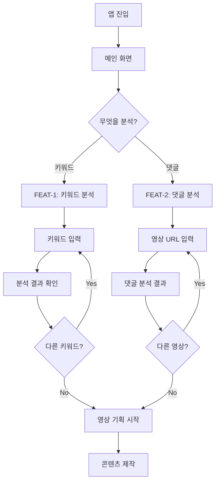
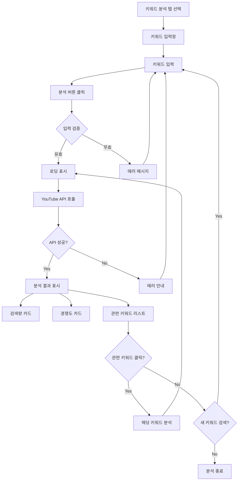
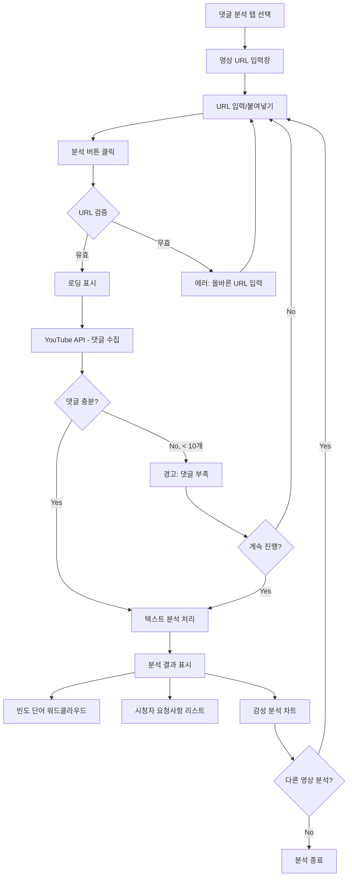
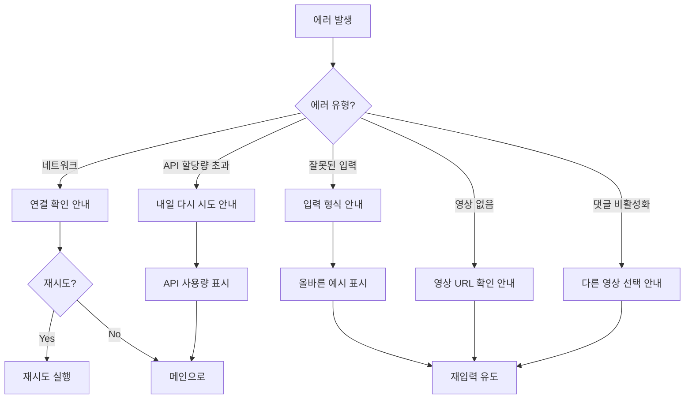

# User Flow (사용자 흐름도)

> 유튜브 키워드 분석기 & 댓글 분석기 - 사용자 여정

---

## MVP 캡슐

| # | 항목 | 내용 |
|---|------|------|
| 1 | 목표 | 바이브코딩 채널의 성장 속도를 높이기 위해 잘 될 콘텐츠 주제를 데이터 기반으로 찾는다 |
| 2 | 페르소나 | 바이브코딩 유튜버 (구독자 5,000명, 영상 50개, 성장 가속화 희망) |
| 3 | 핵심 기능 | FEAT-1: 키워드 분석, FEAT-2: 댓글 분석 |
| 4 | 성공 지표 (노스스타) | 분석 도구를 통해 선정한 주제의 영상 조회수 10,000회 달성 |
| 5 | 입력 지표 | 주 1회 이상 키워드 분석 실행, 월 4회 이상 댓글 분석 실행 |
| 6 | 비기능 요구 | API 응답 시간 5초 이내, 웹 인터페이스 |
| 7 | Out-of-scope | 다른 사용자 서비스, 모바일 앱, 유료화, 인증 시스템 |
| 8 | Top 리스크 | 시간 부족으로 개발 중단 |
| 9 | 완화/실험 | MVP 기능 최소화, 1~2주 내 완료 목표, AI 코딩 활용 |
| 10 | 다음 단계 | YouTube Data API 키 발급 및 테스트 |

---

## 1. 전체 사용자 여정 (Overview)



---

## 2. FEAT-1: 키워드 분석 플로우



### 키워드 분석 결과 화면 구성

```
┌────────────────────────────────────────────────────────┐
│  🔍 키워드 분석                                         │
├────────────────────────────────────────────────────────┤
│  [____________바이브코딩____________] [분석하기]        │
├────────────────────────────────────────────────────────┤
│                                                        │
│  ┌─────────────┐  ┌─────────────┐  ┌─────────────┐    │
│  │   검색량    │  │   경쟁도    │  │   추천도    │    │
│  │   12,000    │  │   중간      │  │   ⭐⭐⭐⭐   │    │
│  │   /월       │  │   (0.45)    │  │   추천!     │    │
│  └─────────────┘  └─────────────┘  └─────────────┘    │
│                                                        │
│  📊 관련 키워드                                        │
│  ┌──────────────────────────────────────────────────┐ │
│  │ AI 코딩      │ 8,000 │ 낮음  │ ⭐⭐⭐⭐⭐ │ [분석] │ │
│  │ cursor ai   │15,000 │ 높음  │ ⭐⭐⭐    │ [분석] │ │
│  │ claude 코딩 │ 5,000 │ 낮음  │ ⭐⭐⭐⭐⭐ │ [분석] │ │
│  └──────────────────────────────────────────────────┘ │
│                                                        │
└────────────────────────────────────────────────────────┘
```

---

## 3. FEAT-2: 댓글 분석 플로우



### 댓글 분석 결과 화면 구성

```
┌────────────────────────────────────────────────────────┐
│  💬 댓글 분석                                           │
├────────────────────────────────────────────────────────┤
│  [___https://youtube.com/watch?v=xxx___] [분석하기]    │
├────────────────────────────────────────────────────────┤
│                                                        │
│  📹 영상 정보: "바이브코딩 입문 가이드"                 │
│  댓글 수: 150개 | 분석 댓글: 100개                     │
│                                                        │
│  ┌─────────────────────────────────────────────────┐  │
│  │  📊 자주 나오는 단어                             │  │
│  │                                                  │  │
│  │      좋아요(45)  궁금해요(23)  감사(18)          │  │
│  │    쉬워요(15)  도움(12)  Claude(10)             │  │
│  │                                                  │  │
│  └─────────────────────────────────────────────────┘  │
│                                                        │
│  ┌─────────────────────────────────────────────────┐  │
│  │  📝 시청자 요청사항                              │  │
│  │                                                  │  │
│  │  1. "다음에는 Claude 사용법도 알려주세요" (❤️ 12)│  │
│  │  2. "실전 프로젝트 영상 부탁드려요" (❤️ 8)       │  │
│  │  3. "Cursor vs Copilot 비교해주세요" (❤️ 5)     │  │
│  │                                                  │  │
│  └─────────────────────────────────────────────────┘  │
│                                                        │
│  ┌─────────────────────────────────────────────────┐  │
│  │  😊 감성 분석                                    │  │
│  │                                                  │  │
│  │  긍정 ████████████████████░░░░ 75%              │  │
│  │  중립 ████░░░░░░░░░░░░░░░░░░░░ 20%              │  │
│  │  부정 █░░░░░░░░░░░░░░░░░░░░░░░  5%              │  │
│  │                                                  │  │
│  └─────────────────────────────────────────────────┘  │
│                                                        │
└────────────────────────────────────────────────────────┘
```

---

## 4. 에러 처리 플로우



---

## 5. 화면 목록 (Screen Inventory)

| 화면 ID | 화면명 | FEAT | 진입점 | 주요 액션 |
|---------|--------|------|--------|----------|
| S-01 | 메인 화면 | - | 앱 실행 | 탭 선택 (키워드/댓글) |
| S-02 | 키워드 분석 | FEAT-1 | S-01 탭 | 키워드 입력, 분석 실행 |
| S-03 | 키워드 결과 | FEAT-1 | S-02 | 결과 확인, 관련 키워드 선택 |
| S-04 | 댓글 분석 | FEAT-2 | S-01 탭 | URL 입력, 분석 실행 |
| S-05 | 댓글 결과 | FEAT-2 | S-04 | 빈도 단어, 요청사항 확인 |
| S-06 | 에러 모달 | 공통 | 에러 발생 시 | 에러 확인, 재시도/닫기 |

---

## 6. 사용자 시나리오 (상세)

### 시나리오 1: 새 영상 주제 찾기

```
1. 앱 접속
2. "키워드 분석" 탭 클릭
3. "Claude 4.5" 입력
4. [분석하기] 클릭
5. 결과 확인:
   - 검색량: 8,000/월
   - 경쟁도: 낮음
   - 추천도: ⭐⭐⭐⭐⭐
6. 관련 키워드에서 "Claude 사용법" 발견
7. [분석] 클릭하여 추가 분석
8. 검색량 15,000, 경쟁도 중간
9. "Claude 사용법 + 실전 팁"으로 주제 결정
```

### 시나리오 2: 경쟁 영상 분석

```
1. 앱 접속
2. "댓글 분석" 탭 클릭
3. 인기 유튜버의 Claude 영상 URL 붙여넣기
4. [분석하기] 클릭
5. 결과 확인:
   - 자주 나오는 단어: "쉬워요", "초보자", "따라하기"
   - 요청사항: "실전 프로젝트 해주세요"
6. 인사이트 발견: 초보자 대상 실전 콘텐츠 수요 높음
7. 영상 기획에 반영
```

---

## Decision Log

| 날짜 | 결정 | 이유 |
|------|------|------|
| 2024-01-17 | 단일 페이지 탭 구조 | 간단한 네비게이션, 빠른 전환 |
| 2024-01-17 | 결과 페이지 분리 안 함 | 입력-결과 동일 화면에서 처리 |
| 2024-01-17 | 모달 에러 처리 | 사용자 흐름 유지 |
