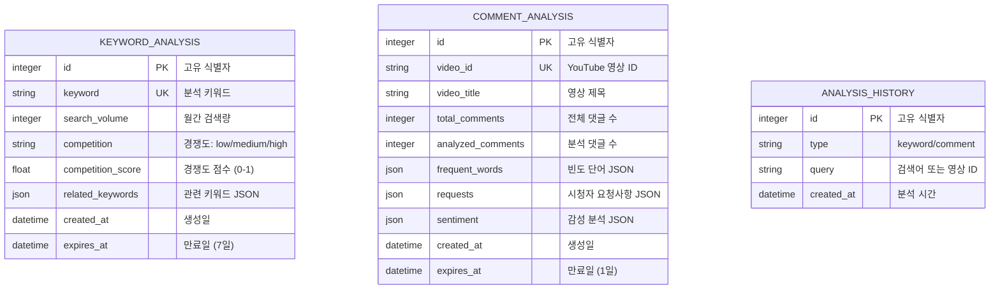
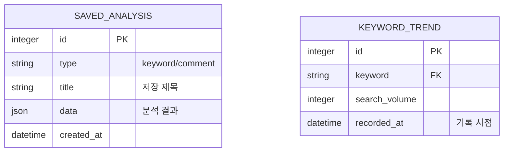

# Database Design (데이터베이스 설계)

> 유튜브 키워드 분석기 & 댓글 분석기 - 데이터 모델

---

## MVP 캡슐

| # | 항목 | 내용 |
|---|------|------|
| 1 | 목표 | 바이브코딩 채널의 성장 속도를 높이기 위해 잘 될 콘텐츠 주제를 데이터 기반으로 찾는다 |
| 2 | 페르소나 | 바이브코딩 유튜버 (구독자 5,000명, 영상 50개, 성장 가속화 희망) |
| 3 | 핵심 기능 | FEAT-1: 키워드 분석, FEAT-2: 댓글 분석 |
| 4 | 성공 지표 (노스스타) | 분석 도구를 통해 선정한 주제의 영상 조회수 10,000회 달성 |
| 5 | 입력 지표 | 주 1회 이상 키워드 분석 실행, 월 4회 이상 댓글 분석 실행 |
| 6 | 비기능 요구 | API 응답 시간 5초 이내, 웹 인터페이스 |
| 7 | Out-of-scope | 다른 사용자 서비스, 모바일 앱, 유료화, 인증 시스템 |
| 8 | Top 리스크 | 시간 부족으로 개발 중단 |
| 9 | 완화/실험 | MVP 기능 최소화, 1~2주 내 완료 목표, AI 코딩 활용 |
| 10 | 다음 단계 | YouTube Data API 키 발급 및 테스트 |

---

## 1. ERD (Entity Relationship Diagram)



---

## 2. 엔티티 상세 정의

### 2.1 KEYWORD_ANALYSIS (키워드 분석 캐시) - FEAT-1

| 컬럼 | 타입 | 제약조건 | 설명 |
|------|------|----------|------|
| id | INTEGER | PK, AUTOINCREMENT | 고유 식별자 |
| keyword | VARCHAR(100) | UNIQUE, NOT NULL | 분석한 키워드 |
| search_volume | INTEGER | NULL | 월간 검색량 (추정치) |
| competition | VARCHAR(20) | NOT NULL | 경쟁도: low/medium/high |
| competition_score | FLOAT | NOT NULL | 경쟁도 점수 (0.0 ~ 1.0) |
| related_keywords | JSON | NULL | 관련 키워드 배열 |
| created_at | DATETIME | NOT NULL, DEFAULT NOW() | 생성일 |
| expires_at | DATETIME | NOT NULL | 만료일 (생성일 + 7일) |

**인덱스:**
- `idx_keyword` ON keyword
- `idx_expires_at` ON expires_at

**JSON 구조 (related_keywords):**
```json
[
  {"keyword": "AI 코딩", "search_volume": 8000, "competition": "low"},
  {"keyword": "cursor ai", "search_volume": 15000, "competition": "high"}
]
```

### 2.2 COMMENT_ANALYSIS (댓글 분석 결과) - FEAT-2

| 컬럼 | 타입 | 제약조건 | 설명 |
|------|------|----------|------|
| id | INTEGER | PK, AUTOINCREMENT | 고유 식별자 |
| video_id | VARCHAR(20) | UNIQUE, NOT NULL | YouTube 영상 ID |
| video_title | VARCHAR(200) | NULL | 영상 제목 |
| total_comments | INTEGER | NOT NULL | 전체 댓글 수 |
| analyzed_comments | INTEGER | NOT NULL | 분석한 댓글 수 |
| frequent_words | JSON | NOT NULL | 빈도 단어 배열 |
| requests | JSON | NULL | 시청자 요청사항 배열 |
| sentiment | JSON | NOT NULL | 감성 분석 결과 |
| created_at | DATETIME | NOT NULL, DEFAULT NOW() | 생성일 |
| expires_at | DATETIME | NOT NULL | 만료일 (생성일 + 1일) |

**인덱스:**
- `idx_video_id` ON video_id
- `idx_expires_at` ON expires_at

**JSON 구조 (frequent_words):**
```json
[
  {"word": "좋아요", "count": 45},
  {"word": "궁금해요", "count": 23}
]
```

**JSON 구조 (requests):**
```json
[
  {"text": "다음에는 Claude 사용법도 알려주세요", "likes": 12},
  {"text": "실전 프로젝트 영상 부탁드려요", "likes": 8}
]
```

**JSON 구조 (sentiment):**
```json
{
  "positive": 0.75,
  "neutral": 0.20,
  "negative": 0.05
}
```

### 2.3 ANALYSIS_HISTORY (분석 히스토리) - 선택

| 컬럼 | 타입 | 제약조건 | 설명 |
|------|------|----------|------|
| id | INTEGER | PK, AUTOINCREMENT | 고유 식별자 |
| type | VARCHAR(20) | NOT NULL | 분석 유형: keyword/comment |
| query | VARCHAR(200) | NOT NULL | 검색어 또는 영상 ID |
| created_at | DATETIME | NOT NULL, DEFAULT NOW() | 분석 시간 |

**인덱스:**
- `idx_created_at` ON created_at DESC

---

## 3. 데이터 생명주기

### 3.1 원칙

- **최소 저장**: API 응답 캐싱 목적으로만 저장
- **자동 만료**: TTL(Time-To-Live) 기반 만료
- **댓글 원본 미저장**: YouTube 정책 준수, 분석 결과만 저장

### 3.2 캐싱 전략

| 데이터 | TTL | 이유 |
|--------|-----|------|
| 키워드 분석 | 7일 | 검색 트렌드는 천천히 변함 |
| 댓글 분석 | 1일 | 댓글은 자주 업데이트됨 |
| 분석 히스토리 | 30일 | 사용 패턴 파악용 |

### 3.3 정리 작업 (Cleanup)

```sql
-- 만료된 키워드 분석 삭제
DELETE FROM keyword_analysis WHERE expires_at < datetime('now');

-- 만료된 댓글 분석 삭제
DELETE FROM comment_analysis WHERE expires_at < datetime('now');

-- 30일 이상 된 히스토리 삭제
DELETE FROM analysis_history WHERE created_at < datetime('now', '-30 days');
```

---

## 4. SQLite 스키마

### 4.1 테이블 생성 SQL

```sql
-- 키워드 분석 캐시
CREATE TABLE IF NOT EXISTS keyword_analysis (
    id INTEGER PRIMARY KEY AUTOINCREMENT,
    keyword VARCHAR(100) UNIQUE NOT NULL,
    search_volume INTEGER,
    competition VARCHAR(20) NOT NULL,
    competition_score FLOAT NOT NULL,
    related_keywords JSON,
    created_at DATETIME NOT NULL DEFAULT CURRENT_TIMESTAMP,
    expires_at DATETIME NOT NULL
);

CREATE INDEX IF NOT EXISTS idx_keyword ON keyword_analysis(keyword);
CREATE INDEX IF NOT EXISTS idx_keyword_expires ON keyword_analysis(expires_at);

-- 댓글 분석 결과
CREATE TABLE IF NOT EXISTS comment_analysis (
    id INTEGER PRIMARY KEY AUTOINCREMENT,
    video_id VARCHAR(20) UNIQUE NOT NULL,
    video_title VARCHAR(200),
    total_comments INTEGER NOT NULL,
    analyzed_comments INTEGER NOT NULL,
    frequent_words JSON NOT NULL,
    requests JSON,
    sentiment JSON NOT NULL,
    created_at DATETIME NOT NULL DEFAULT CURRENT_TIMESTAMP,
    expires_at DATETIME NOT NULL
);

CREATE INDEX IF NOT EXISTS idx_video_id ON comment_analysis(video_id);
CREATE INDEX IF NOT EXISTS idx_comment_expires ON comment_analysis(expires_at);

-- 분석 히스토리
CREATE TABLE IF NOT EXISTS analysis_history (
    id INTEGER PRIMARY KEY AUTOINCREMENT,
    type VARCHAR(20) NOT NULL,
    query VARCHAR(200) NOT NULL,
    created_at DATETIME NOT NULL DEFAULT CURRENT_TIMESTAMP
);

CREATE INDEX IF NOT EXISTS idx_history_created ON analysis_history(created_at DESC);
```

---

## 5. SQLAlchemy 모델

```python
from datetime import datetime, timedelta
from sqlalchemy import Column, Integer, String, Float, DateTime, JSON
from sqlalchemy.ext.declarative import declarative_base

Base = declarative_base()

class KeywordAnalysis(Base):
    __tablename__ = "keyword_analysis"

    id = Column(Integer, primary_key=True, autoincrement=True)
    keyword = Column(String(100), unique=True, nullable=False)
    search_volume = Column(Integer, nullable=True)
    competition = Column(String(20), nullable=False)
    competition_score = Column(Float, nullable=False)
    related_keywords = Column(JSON, nullable=True)
    created_at = Column(DateTime, default=datetime.utcnow, nullable=False)
    expires_at = Column(DateTime, nullable=False)

    @staticmethod
    def default_expires_at():
        return datetime.utcnow() + timedelta(days=7)


class CommentAnalysis(Base):
    __tablename__ = "comment_analysis"

    id = Column(Integer, primary_key=True, autoincrement=True)
    video_id = Column(String(20), unique=True, nullable=False)
    video_title = Column(String(200), nullable=True)
    total_comments = Column(Integer, nullable=False)
    analyzed_comments = Column(Integer, nullable=False)
    frequent_words = Column(JSON, nullable=False)
    requests = Column(JSON, nullable=True)
    sentiment = Column(JSON, nullable=False)
    created_at = Column(DateTime, default=datetime.utcnow, nullable=False)
    expires_at = Column(DateTime, nullable=False)

    @staticmethod
    def default_expires_at():
        return datetime.utcnow() + timedelta(days=1)


class AnalysisHistory(Base):
    __tablename__ = "analysis_history"

    id = Column(Integer, primary_key=True, autoincrement=True)
    type = Column(String(20), nullable=False)  # "keyword" or "comment"
    query = Column(String(200), nullable=False)
    created_at = Column(DateTime, default=datetime.utcnow, nullable=False)
```

---

## 6. 확장 고려사항

### 6.1 v2에서 추가 예정



### 6.2 마이그레이션 계획

- SQLite → PostgreSQL 전환 시:
  - JSON 컬럼은 JSONB로 변경
  - datetime → timestamp with time zone
  - 인덱스 재생성

---

## Decision Log

| 날짜 | 결정 | 이유 |
|------|------|------|
| 2024-01-17 | SQLite 사용 | 단일 사용자, 간단한 캐싱 목적 |
| 2024-01-17 | JSON 컬럼 사용 | 관련 키워드, 요청사항 등 가변 데이터 |
| 2024-01-17 | 캐시 만료 기반 | API 할당량 절약, 최신 데이터 유지 |
| 2024-01-17 | 댓글 원본 미저장 | YouTube 정책 준수 |
