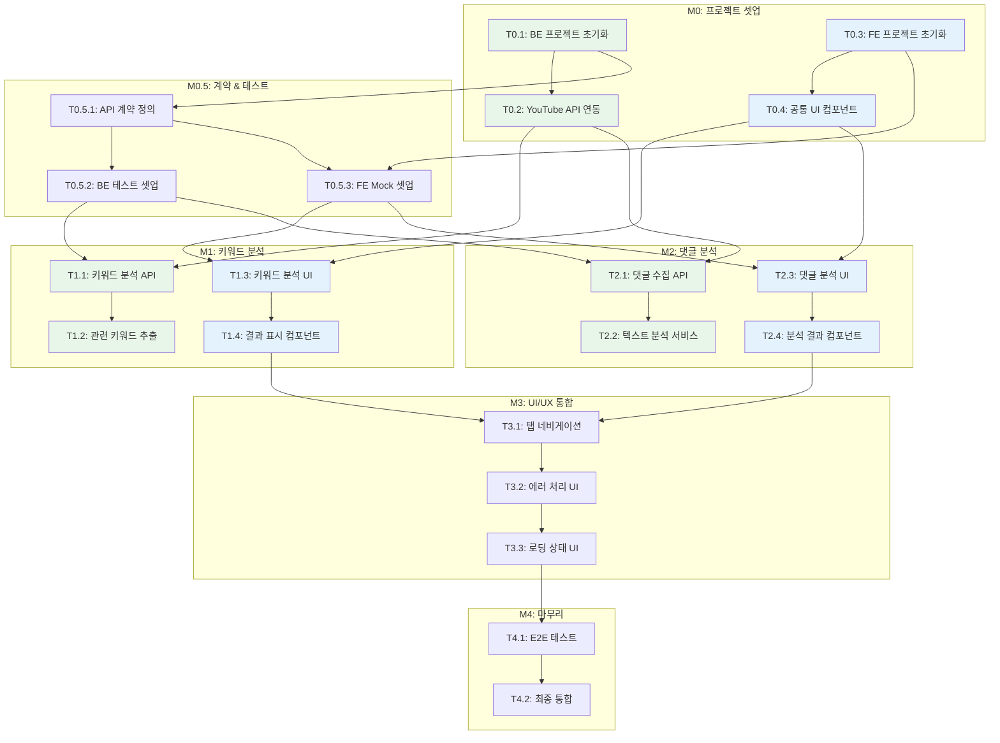

# TASKS: 유튜브 키워드 분석기 & 댓글 분석기

> 바이브코딩 채널 성장을 위한 데이터 분석 도구 개발 태스크 목록

---

## 마일스톤 개요

| 마일스톤 | 설명 | 태스크 수 | 예상 기간 |
|----------|------|----------|----------|
| M0 | 프로젝트 셋업 | 4개 | 1일 |
| M0.5 | 계약 & 테스트 기반 | 3개 | 0.5일 |
| M1 | FEAT-1: 키워드 분석 | 4개 | 3일 |
| M2 | FEAT-2: 댓글 분석 | 4개 | 3일 |
| M3 | UI/UX 통합 | 3개 | 2일 |
| M4 | 마무리 & 배포 | 2개 | 1일 |

**총 예상 기간**: 10~11일 (1.5주)

---

## 병렬 실행 가능 태스크 매트릭스

| Phase | 백엔드 | 프론트엔드 | 동시 실행 |
|-------|--------|-----------|----------|
| Phase 0 | T0.1, T0.2 | T0.3, T0.4 | ✅ 가능 |
| Phase 0.5 | T0.5.1 | T0.5.2, T0.5.3 | ✅ 가능 |
| Phase 1 | T1.1, T1.2 | T1.3, T1.4 | ✅ 가능 (Mock 기반) |
| Phase 2 | T2.1, T2.2 | T2.3, T2.4 | ✅ 가능 (Mock 기반) |
| Phase 3 | - | T3.1, T3.2, T3.3 | ✅ 가능 |
| Phase 4 | T4.1 | T4.2 | ⚠️ 순차 실행 권장 |

---

## 의존성 그래프



**범례**: 🟩 백엔드 | 🟦 프론트엔드

---

## M0: 프로젝트 셋업

### [x] Phase 0, T0.1: 백엔드 프로젝트 초기화

**담당**: backend-specialist

**작업 내용**:
- FastAPI 프로젝트 구조 생성
- SQLite 데이터베이스 설정 (SQLAlchemy)
- 환경 변수 설정 (.env)
- Docker Compose 설정

**산출물**:
- `backend/app/main.py`
- `backend/app/core/config.py`
- `backend/app/core/database.py`
- `backend/requirements.txt`
- `docker-compose.yml`
- `.env.example`

**완료 조건**:
- [ ] `uvicorn app.main:app --reload` 실행 성공
- [ ] `/health` 엔드포인트 응답 확인
- [ ] SQLite 데이터베이스 연결 확인

---

### [x] Phase 0, T0.2: YouTube API 연동

**담당**: backend-specialist

**의존성**: T0.1 완료 필요

**작업 내용**:
- YouTube Data API v3 클라이언트 구현
- API 키 환경 변수 설정
- 기본 검색/댓글 조회 기능

**산출물**:
- `backend/app/services/youtube.py`

**완료 조건**:
- [ ] YouTube API 키로 검색 API 호출 성공
- [ ] 댓글 조회 API 호출 성공
- [ ] API 할당량 확인 기능

---

### [x] Phase 0, T0.3: 프론트엔드 프로젝트 초기화

**담당**: frontend-specialist

**작업 내용**:
- Vite + React + TypeScript 프로젝트 생성
- TailwindCSS 설정
- 디렉토리 구조 생성
- 기본 타입 정의

**산출물**:
- `frontend/src/App.tsx`
- `frontend/src/main.tsx`
- `frontend/src/types/index.ts`
- `frontend/tailwind.config.js`
- `frontend/package.json`

**완료 조건**:
- [ ] `npm run dev` 실행 성공
- [ ] TailwindCSS 스타일 적용 확인
- [ ] TypeScript 컴파일 성공

---

### [x] Phase 0, T0.4: 공통 UI 컴포넌트 구현

**담당**: frontend-specialist

**의존성**: T0.3 완료 필요

**작업 내용**:
- Design System 기반 공통 컴포넌트
- Button, Input, Card, Badge, Tab 컴포넌트
- Loading, Error 상태 컴포넌트

**산출물**:
- `frontend/src/components/ui/Button.tsx`
- `frontend/src/components/ui/Input.tsx`
- `frontend/src/components/ui/Card.tsx`
- `frontend/src/components/ui/Badge.tsx`
- `frontend/src/components/ui/Tab.tsx`
- `frontend/src/components/ui/Loading.tsx`
- `frontend/src/components/ui/ErrorMessage.tsx`

**완료 조건**:
- [ ] 모든 UI 컴포넌트 렌더링 확인
- [ ] Design System 색상/타이포 적용

---

## M0.5: 계약 & 테스트 기반

### [x] Phase 0, T0.5.1: API 계약 정의

**담당**: backend-specialist

**의존성**: T0.1 완료 필요

**작업 내용**:
- 키워드 분석 API 스키마 정의 (Pydantic)
- 댓글 분석 API 스키마 정의 (Pydantic)
- 공통 응답 형식 정의

**산출물**:
- `backend/app/schemas/keyword.py`
- `backend/app/schemas/comment.py`
- `backend/app/schemas/common.py`

**완료 조건**:
- [ ] 모든 Request/Response 스키마 정의
- [ ] OpenAPI 문서 자동 생성 확인 (/docs)

---

### [x] Phase 0, T0.5.2: 백엔드 테스트 환경 셋업

**담당**: test-specialist

**의존성**: T0.5.1 완료 필요

**작업 내용**:
- pytest 설정
- 테스트 데이터베이스 분리
- API 테스트 기반 클래스

**산출물**:
- `backend/tests/conftest.py`
- `backend/tests/api/__init__.py`
- `backend/pyproject.toml` (pytest 설정)

**완료 조건**:
- [ ] `pytest` 실행 성공 (테스트 0개라도)
- [ ] 테스트 DB 분리 확인

---

### [x] Phase 0, T0.5.3: 프론트엔드 Mock 환경 셋업

**담당**: frontend-specialist

**의존성**: T0.5.1 완료 필요

**작업 내용**:
- MSW (Mock Service Worker) 설정
- API 계약 기반 Mock 핸들러
- Vitest 테스트 환경

**산출물**:
- `frontend/src/mocks/handlers/keyword.ts`
- `frontend/src/mocks/handlers/comment.ts`
- `frontend/src/mocks/browser.ts`
- `frontend/src/mocks/server.ts`
- `frontend/vitest.config.ts`

**완료 조건**:
- [ ] MSW 개발 모드 동작 확인
- [ ] Mock API 응답 확인
- [ ] Vitest 실행 성공

---

## M1: 키워드 분석 (FEAT-1)

### [x] Phase 1, T1.1: 키워드 분석 API RED→GREEN

**담당**: backend-specialist

**의존성**: T0.2, T0.5.2 완료 필요

**Git Worktree 설정**:
```bash
# 1. Worktree 생성
git worktree add ../zettel-phase1-keyword-api -b phase/1-keyword-api
cd ../zettel-phase1-keyword-api
```

**TDD 사이클**:

1. **RED**: 테스트 작성 (실패 확인)
   ```bash
   # 테스트 파일: tests/api/test_keywords.py
   pytest tests/api/test_keywords.py -v  # Expected: FAILED
   ```

2. **GREEN**: 최소 구현 (테스트 통과)
   ```bash
   # 구현 파일: app/api/keywords.py, app/services/keyword_analyzer.py
   pytest tests/api/test_keywords.py -v  # Expected: PASSED
   ```

3. **REFACTOR**: 코드 정리

**작업 내용**:
- POST /api/v1/keywords/analyze 엔드포인트
- YouTube API 기반 검색량 추정
- 경쟁도 계산 로직
- 캐시 저장 (7일 TTL)

**산출물**:
- `backend/tests/api/test_keywords.py` (테스트)
- `backend/app/api/keywords.py` (라우트)
- `backend/app/services/keyword_analyzer.py` (서비스)
- `backend/app/models/analysis.py` (DB 모델)

**인수 조건**:
- [ ] 테스트 먼저 작성됨 (RED 확인)
- [ ] 모든 테스트 통과 (GREEN)
- [ ] 커버리지 >= 80%
- [ ] API 응답 시간 < 5초

**완료 시 자동 실행**:
```bash
git add -A && git commit -m "$(cat <<'EOF'
기능: 키워드 분석 API 구현

- POST /api/v1/keywords/analyze 엔드포인트
- YouTube API 기반 검색량 추정
- 경쟁도 계산 로직
- 7일 TTL 캐싱

태스크: Phase 1, T1.1
EOF
)"
git checkout main && git merge phase/1-keyword-api --no-ff -m "병합: Phase 1 - 키워드 분석 API"
git worktree remove ../zettel-phase1-keyword-api && git branch -d phase/1-keyword-api
```

---

### [x] Phase 1, T1.2: 관련 키워드 추출 RED→GREEN

**담당**: backend-specialist

**의존성**: T1.1 완료 필요

**Git Worktree 설정**:
```bash
git worktree add ../zettel-phase1-related-keywords -b phase/1-related-keywords
cd ../zettel-phase1-related-keywords
```

**TDD 사이클**:

1. **RED**: 테스트 작성
   ```bash
   pytest tests/api/test_keywords.py::test_related_keywords -v
   ```

2. **GREEN**: 구현
   ```bash
   # app/services/keyword_analyzer.py에 관련 키워드 로직 추가
   pytest tests/api/test_keywords.py -v
   ```

**작업 내용**:
- YouTube 검색 결과에서 관련 키워드 추출
- 각 관련 키워드의 검색량/경쟁도 계산
- 추천 점수 계산

**산출물**:
- `backend/tests/api/test_keywords.py` (테스트 추가)
- `backend/app/services/keyword_analyzer.py` (로직 추가)

**인수 조건**:
- [ ] 관련 키워드 5~10개 추출
- [ ] 각 키워드에 검색량, 경쟁도 포함
- [ ] 테스트 통과

---

### [x] Phase 1, T1.3: 키워드 분석 UI RED→GREEN

**담당**: frontend-specialist

**의존성**: T0.4, T0.5.3 완료 필요 (Mock 기반 독립 개발 가능)

**Git Worktree 설정**:
```bash
git worktree add ../zettel-phase1-keyword-ui -b phase/1-keyword-ui
cd ../zettel-phase1-keyword-ui
```

**TDD 사이클**:

1. **RED**: 테스트 작성
   ```bash
   npm test -- src/__tests__/pages/KeywordPage.test.tsx
   ```

2. **GREEN**: 컴포넌트 구현
   ```bash
   npm test
   ```

**작업 내용**:
- 키워드 입력 폼
- 분석 버튼 + 로딩 상태
- useKeywordAnalysis 훅

**산출물**:
- `frontend/src/__tests__/pages/KeywordPage.test.tsx`
- `frontend/src/pages/KeywordPage.tsx`
- `frontend/src/hooks/useKeywordAnalysis.ts`
- `frontend/src/services/api.ts` (키워드 API)

**인수 조건**:
- [ ] 키워드 입력 및 분석 요청 동작
- [ ] 로딩 상태 표시
- [ ] Mock API로 테스트 통과

---

### [x] Phase 1, T1.4: 키워드 결과 표시 컴포넌트 RED→GREEN

**담당**: frontend-specialist

**의존성**: T1.3 완료 필요

**Git Worktree 설정**:
```bash
git worktree add ../zettel-phase1-keyword-result -b phase/1-keyword-result
cd ../zettel-phase1-keyword-result
```

**작업 내용**:
- 검색량/경쟁도/추천도 카드
- 관련 키워드 리스트
- 관련 키워드 클릭 시 재분석

**산출물**:
- `frontend/src/__tests__/components/keyword/KeywordResultCard.test.tsx`
- `frontend/src/components/keyword/KeywordResultCard.tsx`
- `frontend/src/components/keyword/RelatedKeywordList.tsx`

**인수 조건**:
- [ ] 3개 카드 (검색량, 경쟁도, 추천도) 표시
- [ ] 관련 키워드 클릭 시 분석 트리거
- [ ] 테스트 통과

---

## M2: 댓글 분석 (FEAT-2)

### [x] Phase 2, T2.1: 댓글 수집 API RED→GREEN

**담당**: backend-specialist

**의존성**: T0.2, T0.5.2 완료 필요

**Git Worktree 설정**:
```bash
git worktree add ../zettel-phase2-comment-api -b phase/2-comment-api
cd ../zettel-phase2-comment-api
```

**TDD 사이클**:

1. **RED**: 테스트 작성
   ```bash
   pytest tests/api/test_comments.py -v
   ```

2. **GREEN**: 구현
   ```bash
   pytest tests/api/test_comments.py -v
   ```

**작업 내용**:
- POST /api/v1/comments/analyze 엔드포인트
- YouTube 영상 URL 파싱
- 댓글 수집 (최대 100개)
- 영상 정보 조회

**산출물**:
- `backend/tests/api/test_comments.py`
- `backend/app/api/comments.py`
- `backend/app/services/youtube.py` (댓글 수집 로직)

**인수 조건**:
- [ ] 영상 URL에서 댓글 수집 성공
- [ ] 댓글 수 부족 시 경고 메시지
- [ ] 테스트 통과

---

### [x] Phase 2, T2.2: 텍스트 분석 서비스 RED→GREEN

**담당**: backend-specialist

**의존성**: T2.1 완료 필요

**Git Worktree 설정**:
```bash
git worktree add ../zettel-phase2-text-analysis -b phase/2-text-analysis
cd ../zettel-phase2-text-analysis
```

**작업 내용**:
- 한국어 형태소 분석 (KoNLPy 또는 간단한 토큰화)
- 빈도 단어 추출
- 요청사항 패턴 감지 ("~해주세요", "~하면 좋겠어요")
- 감성 분석 (긍정/부정/중립)

**산출물**:
- `backend/tests/services/test_comment_analyzer.py`
- `backend/app/services/comment_analyzer.py`

**인수 조건**:
- [ ] 빈도 단어 상위 20개 추출
- [ ] 요청사항 패턴 감지
- [ ] 감성 비율 계산
- [ ] 테스트 통과

---

### [x] Phase 2, T2.3: 댓글 분석 UI RED→GREEN

**담당**: frontend-specialist

**의존성**: T0.4, T0.5.3 완료 필요 (Mock 기반 독립 개발 가능)

**Git Worktree 설정**:
```bash
git worktree add ../zettel-phase2-comment-ui -b phase/2-comment-ui
cd ../zettel-phase2-comment-ui
```

**작업 내용**:
- 영상 URL 입력 폼
- 분석 버튼 + 로딩 상태
- useCommentAnalysis 훅

**산출물**:
- `frontend/src/__tests__/pages/CommentPage.test.tsx`
- `frontend/src/pages/CommentPage.tsx`
- `frontend/src/hooks/useCommentAnalysis.ts`
- `frontend/src/services/api.ts` (댓글 API 추가)

**인수 조건**:
- [ ] URL 입력 및 분석 요청 동작
- [ ] URL 검증 (YouTube URL 형식)
- [ ] Mock API로 테스트 통과

---

### [x] Phase 2, T2.4: 댓글 분석 결과 컴포넌트 RED→GREEN

**담당**: frontend-specialist

**의존성**: T2.3 완료 필요

**Git Worktree 설정**:
```bash
git worktree add ../zettel-phase2-comment-result -b phase/2-comment-result
cd ../zettel-phase2-comment-result
```

**작업 내용**:
- 빈도 단어 표시 (워드클라우드 또는 리스트)
- 시청자 요청사항 리스트
- 감성 분석 차트 (프로그레스 바)

**산출물**:
- `frontend/src/__tests__/components/comment/CommentResultCard.test.tsx`
- `frontend/src/components/comment/FrequentWords.tsx`
- `frontend/src/components/comment/RequestList.tsx`
- `frontend/src/components/comment/SentimentChart.tsx`

**인수 조건**:
- [ ] 빈도 단어 시각화
- [ ] 요청사항 좋아요 순 정렬
- [ ] 감성 비율 시각화
- [ ] 테스트 통과

---

## M3: UI/UX 통합

### [x] Phase 3, T3.1: 탭 네비게이션 RED→GREEN

**담당**: frontend-specialist

**의존성**: T1.4, T2.4 완료 필요

**Git Worktree 설정**:
```bash
git worktree add ../zettel-phase3-navigation -b phase/3-navigation
cd ../zettel-phase3-navigation
```

**작업 내용**:
- 헤더 컴포넌트 (로고, 탭)
- 키워드 분석 / 댓글 분석 탭 전환
- 상태 유지 (탭 전환 시 데이터 유지)

**산출물**:
- `frontend/src/__tests__/components/Header.test.tsx`
- `frontend/src/components/Header.tsx`
- `frontend/src/App.tsx` (라우팅/탭 통합)

**인수 조건**:
- [ ] 탭 전환 동작
- [ ] 현재 탭 하이라이트
- [ ] 데이터 유지

---

### [x] Phase 3, T3.2: 에러 처리 UI RED→GREEN

**담당**: frontend-specialist

**의존성**: T3.1 완료 필요

**Git Worktree 설정**:
```bash
git worktree add ../zettel-phase3-error -b phase/3-error
cd ../zettel-phase3-error
```

**작업 내용**:
- 에러 모달 컴포넌트
- API 에러 타입별 메시지
- 재시도 버튼

**산출물**:
- `frontend/src/__tests__/components/ui/ErrorModal.test.tsx`
- `frontend/src/components/ui/ErrorModal.tsx`
- `frontend/src/utils/errorMessages.ts`

**인수 조건**:
- [ ] 네트워크 에러 표시
- [ ] API 할당량 초과 안내
- [ ] 재시도 동작

---

### [x] Phase 3, T3.3: 로딩 상태 UI RED→GREEN

**담당**: frontend-specialist

**의존성**: T3.2 완료 필요

**Git Worktree 설정**:
```bash
git worktree add ../zettel-phase3-loading -b phase/3-loading
cd ../zettel-phase3-loading
```

**작업 내용**:
- 스켈레톤 로딩 컴포넌트
- 분석 진행 상태 표시
- 버튼 로딩 상태

**산출물**:
- `frontend/src/__tests__/components/ui/Skeleton.test.tsx`
- `frontend/src/components/ui/Skeleton.tsx`
- `frontend/src/components/ui/LoadingOverlay.tsx`

**인수 조건**:
- [ ] 카드 스켈레톤 표시
- [ ] 분석 중 상태 메시지
- [ ] 버튼 비활성화 + 스피너

---

## M4: 마무리 & 배포

### [x] Phase 4, T4.1: E2E 테스트 RED→GREEN

**담당**: test-specialist

**의존성**: T3.3 완료 필요

**Git Worktree 설정**:
```bash
git worktree add ../zettel-phase4-e2e -b phase/4-e2e
cd ../zettel-phase4-e2e
```

**작업 내용**:
- Playwright 설정
- 키워드 분석 플로우 테스트
- 댓글 분석 플로우 테스트
- 에러 처리 테스트

**산출물**:
- `frontend/e2e/keyword.spec.ts`
- `frontend/e2e/comment.spec.ts`
- `frontend/playwright.config.ts`

**인수 조건**:
- [ ] 키워드 분석 E2E 통과
- [ ] 댓글 분석 E2E 통과
- [ ] 에러 케이스 E2E 통과

---

### [x] Phase 4, T4.2: 최종 통합 및 문서화

**담당**: backend-specialist, frontend-specialist

**의존성**: T4.1 완료 필요

**Git Worktree 설정**:
```bash
git worktree add ../zettel-phase4-final -b phase/4-final
cd ../zettel-phase4-final
```

**작업 내용**:
- FE-BE 실제 연동 테스트
- README.md 작성
- 실행 가이드 작성
- Docker Compose 최종 확인

**산출물**:
- `README.md`
- `.env.example` 업데이트
- `docker-compose.yml` 최종

**인수 조건**:
- [ ] `docker-compose up` 실행 성공
- [ ] 전체 플로우 수동 테스트 통과
- [ ] README 완성

---

## 요약: 다음 우선순위 작업

**즉시 시작 가능 (병렬)**:
1. **T0.1**: 백엔드 프로젝트 초기화
2. **T0.3**: 프론트엔드 프로젝트 초기화

**T0.1 완료 후**:
- T0.2: YouTube API 연동
- T0.5.1: API 계약 정의

**T0.3 완료 후**:
- T0.4: 공통 UI 컴포넌트

---

## 참고 문서

- [01-prd.md](./01-prd.md) - 제품 요구사항
- [02-trd.md](./02-trd.md) - 기술 요구사항
- [03-user-flow.md](./03-user-flow.md) - 사용자 흐름
- [04-database-design.md](./04-database-design.md) - DB 설계
- [05-design-system.md](./05-design-system.md) - 디자인 시스템
- [07-coding-convention.md](./07-coding-convention.md) - 코딩 컨벤션
